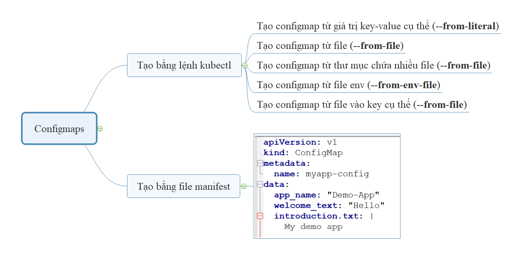
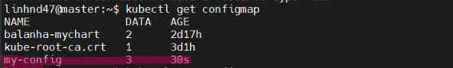
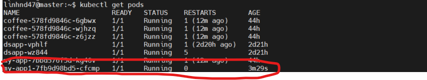
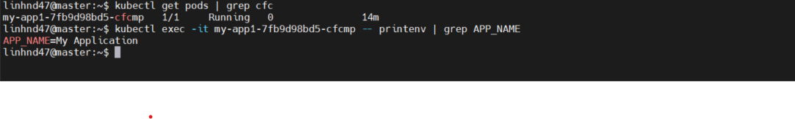
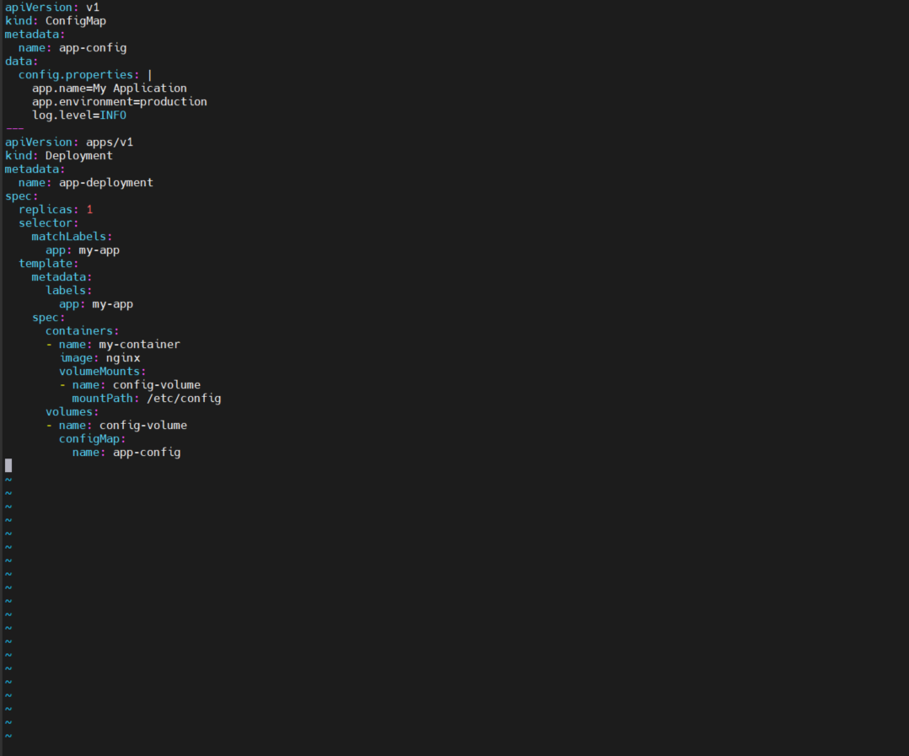
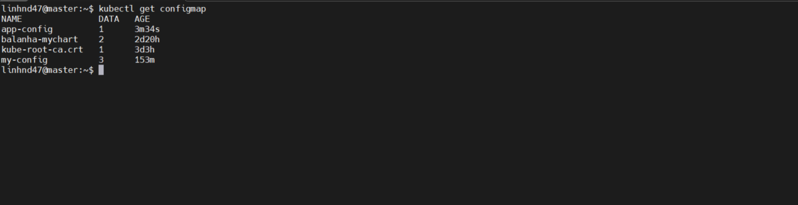
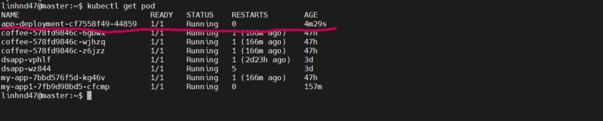
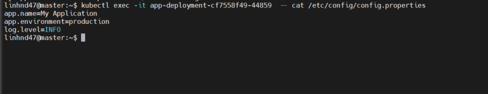

`---------------- ConfigMap -------------------`

## 1. `Khái niệm`

- Là một tài nguyên mức namespace trên k8s dùng để lưu trữ các dữ liệu dạng key-value.
- Pod có thể sử dụng configmaps dưới dạng các biến môi trường, dùng như tham số trong câu lệnh commandline trong pod

---> Lưu ý `configmap không mã hóa dữ liệu, dữ liệu lưu trong configmap dưới dạng plain text`.

- Sử dụng configmap giúp cho ứng dụng trở nên linh động hơn. Các tham số của ứng dụng đều được cấu hình từ các biến môi trường hoặc từ file config.

---> Lưu ý `khi sử dụng configmap cho Pod thì configmap và pod phải ở cùng namespace`

## 2. `Vai trò`

- `Tách biệt cấu hình và logic ứng dụng`: Thay vì ghi cứng (hardcode) các giá trị cấu hình trong mã nguồn, bạn có thể lưu trữ chúng trong ConfigMap.

- `Quản lý cấu hình theo môi trường`: Bạn có thể dễ dàng thay đổi cấu hình dựa trên môi trường (development, staging, production) mà không cần thay đổi ứng dụng.

- `Tái sử dụng cấu hình`: Một ConfigMap có thể được sử dụng bởi nhiều Pods hoặc Deployments.

## 3. `Cấu trúc file manifest của ConfigMap`

    kind: ConfigMap
    apiVersion: v1
    metadata:
        name: example-configmap
        namespace: default
    data:
        # Configuration Values are stored as key-value pairs
        title: "introduction to k8s"
        auth: "viettq"
        publish_date: "16/08/2024"

---> Khác với 1 số object thì configMap sẽ không có phần `spec` mà thay vào đó là trường `data` và trong đó khai báo bộ giá trị `key-value`.

## 4. `Một số cách tạo configMap`

### 4.1 Tạo configmap từ giá trị cụ thể:

    kubectl -n [namespace] create configmap [configmap-name] --from-literal [key1=value1] --from-literal [key2=value2] --from-literal [keyN=valueN]

### 4.2 Tạo configmap từ file filename:

    kubectl -n [namespace] create configmap [configmap-name] --from-file [filename]

### 4.3 Tạo configmap từ thư mục config-dir:

    kubectl -n [namespace] create configmap [configmap-name] --from-file [config-dir]

### 4.4 Tạo configmap từ file biến môi trường có tên env-file:

    kubectl -n [namespace] create configmap [configmap-name] --from-env-file [env-file]

Kiểm tra nội dung cfm vừa tạo:

        kubectl -n [namespace] get configmap [configmap-name] -oyam

## 5. `Ví dụ về configmap`

Bước 1: Tạo file `vim confimap.yaml`

    apiVersion: v1
    kind: ConfigMap
    metadata:
      name: my-config
    data:
      app-name: "My Application"
      app-environment: "production"
      log-level: "INFO"

Bước 2: Tạo tiếp file Deployment để tạo ra các pod và trường biến vào trong container
`vim deploy_configmap.yaml`

    apiVersion: apps/v1
    kind: Deployment
    metadata:
    name: my-app
    spec:
    replicas: 1
    selector:
      matchLabels:
        app: my-app
    template:
      metadata:
      labels:
        app: my-app
      spec:
        containers:
        - name: my-container
          image: nginx
          # Cấu hình để map với file configmap.yaml
          env:
          - name: APP_NAME
            valueFrom:
              configMapKeyRef:
                name: my-config
                key: app-name
          - name: APP_ENVIRONMENT
            valueFrom:
              configMapKeyRef:
                name: my-config
                key: app-environment

--> `Trong ví dụ này, các biến môi trường APP_NAME và APP_ENVIRONMENT trong container sẽ lấy giá trị từ ConfigMap my-config.`

Bước 3: Kiểm tra

- List configmap

- List pod

- Kiểm tra biến trong container

## `Ví dụ 2: Mount ConfigMap thành tệp tin`

- Trong phần này ta sẽ gộp cả file configmap và deployment thành 1 file .yaml duy nhất

        vim configmap_dep_mount.yaml

--> `Trong ví dụ này, nội dung của config.properties từ ConfigMap sẽ được mount vào thư mục /etc/config/config.properties trong container.`

        kubectl apply -f configmap_dep_mount.yaml

- Kiểm tra configmap
  
- Kiểm tra pod
  

- ConfigMap được mount dưới dạng tệp tin, bạn có thể vào trong container và kiểm tra tệp đó:

  

