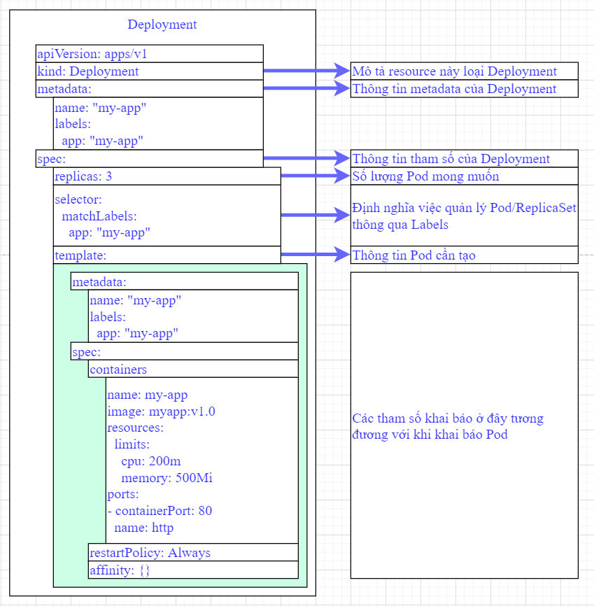

## 1. `Khái niệm`

- Deployment là một tài nguyên trên K8S giúp ta quản lý các Pod và ReplicaSet.
- Nó cung cấp một cách khai báo để xác định và cập nhật các ứng dụng, đảm bảo rằng trạng thái mong muốn được duy trì trong suốt quá trình triển khai.

## 2. `Trường hợp sử dụng`

- Scale up/down số lượng Pod của một ứng dụng.
- Tạo Deployment để triển khai một ReplicaSet
- Khai báo trạng thái mới của Pod.
- Quay lại bản sửa đổi Triển khai trước đó nếu trạng thái hiện tại của Triển khai không ổn định. Mỗi lần quay lại sẽ cập nhật bản sửa đổi của Triển khai.

        kubectl rollout history deployment/nginx-deployment - xem các bản version trước

        kubectl rollout undo deployment/nginx-deployment - Lệnh thực thi quay lại version trước đó

## 3. `Tạo file Deployment`

- Để tạo Deployment, bạn có thể sử dụng tệp manifest YAML hoặc JSON. Sau đây là ví dụ về định nghĩa Deployment đơn giản:

  

## 4. `Rolling Updates`

- Một trong những tính năng chính của Deployments là khả năng thực hiện cập nhật liên tục
- Điều này có nghĩa là bạn có thể cập nhật ứng dụng của mình mà không bị ngừng hoạt động bằng cách dần dần thay thế các Pod cũ bằng các Pod mới.

        spec:
          strategy:
            type: RollingUpdate
            rollingUpdate:
              maxSurge: 1
              maxUnavailable: 0

- ví dụ này, `maxSurge` chỉ định số lượng Pod tối đa có thể được tạo vượt quá số lượng mong muốn và `maxUnavailable` chỉ định số lượng Pod tối đa có thể không khả dụng trong quá trình cập nhật.

## 5. `Scaling a Deployment`

- Việc mở rộng quy mô Triển khai cũng đơn giản như việc thay đổi số lượng bản sao trong bản kê khai Triển khai. Bạn có thể sử dụng lệnh `kubectl scale` để mở rộng Deployment

        kubectl scale deployment my-deployment --replicas=5

        kubectl set image deployment/nginx-deployment nginx=nginx:1.16 - cập nhật image

## 6. `Rolling Back a Deployment`

- Trong trường hợp có sự cố xảy ra trong quá trình cập nhật, bạn có thể dễ dàng quay lại phiên bản trước của Deployment. Điều này có thể được thực hiện bằng lệnh `kubectl rollout undo`

        kubectl rollout undo deployment my-deployment

## 7. `Managing Deployments with Labels and Selectors`

- Labels và Selector đóng vai trò quan trọng trong việc quản lý Triển khai. Bằng cách gắn nhãn tài nguyên, bạn có thể dễ dàng nhóm và quản lý chúng
- Ví dụ: bạn có thể liệt kê tất cả các Triển khai có nhãn cụ thể bằng cách sử dụng lệnh `kubectl get deployment -l`
- 2 thành phần lables và matchsLables phải giống nhau 1 hoặc nhiều cặp key : value

## 8. `Delete a deployment`

        kubectl -n demo delete deployments.apps myapp-deployment

## 9. `Scaling and Load Balancing`

- Kubernetes Deployments hoạt động kết hợp với Services để cung cấp khả năng mở rộng và cân bằng tải.
- Services cho phép truy cập bên ngoài vào Deployments và phân phối lưu lượng giữa các Pod
- Theo mặc định, Kubernetes tạo một Service cho mỗi Deployments.

