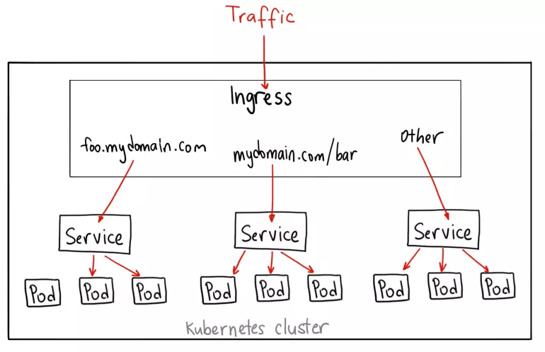

## `1.Tại sao chúng ta cần Ingress`

Dùng để giải quyết các vấn đề mà Node Port đang gặp phải:

- Các service ứng dụng sẽ được expose dưới dạng ClusterIP và sau đó được expose ra bên ngoài qua Ingress --> Service thực sự trong suốt với người dùng. Người dùng chỉ thực sự kết nối tới Ingress Controller.
- Có thể dùng thêm external LoadBalancer bên ngoài để trỏ tới IngressController
- Không bị hạn chế bởi số lượng Port mà NodePort có thể cung cấp.

## `2. Kubernetes Ingress là gì?`

- Ingress mở và phân luồng các kết nối HTTP và HTTPS từ bên ngoài k8s cluster vào các services bên trong cluster
- Việc phân luồng dữ liệu này được quản lý bởi các "rule" được định nghĩa ở các tài nguyên Ingress trên k8s.
- Mà việc phân luồng được thực hiện bởi _Ingress Controller_ là _opensource_ cài trên k8s.

  

### _Cơ chế hoạt động của Ingress_

Cơ chế hoặc động của Igress gồm 2 thành phần chính:

- Ingress Controller: Là thành phần điều khiển chính làm nhiệm vụ điều hướng các request tới các service bên trong k8s. Thường thì Ingress Controller được cài đặt trên K8S và được expose ra ngoài dưới dạng NodePort.

- Ingress Rule: Là một tài nguyên trên K8S. Nó chứa nội dung khai báo rule để điều hướng từ một request tới một service cụ thể trên trong K8S.

_Lưu ý: Ingress Rule: Là một tài nguyên trên K8S. Nó chứa nội dung khai báo rule để điều hướng từ một request tới một service cụ thể trên trong K8S_

### `3. Cấu trúc của Ingress Resource`

Ingress là một tài nguyên ở mức Namespace trên K8S. Và giống như các tài nguyên khác như Pod, Deployment hay Service.

`Ví dụ nội dung một file định nghĩa Ingress như sau:`

    apiVersion: networking.k8s.io/v1
    kind: Ingress
    metadata:
      name: minimal-ingress
      annotations:
        nginx.ingress.kubernetes.io/rewrite-target: /
    spec:
      ingressClassName: nginx-example
      rules:
      - http:
          paths:
          - path: /testpath
            pathType: Prefix
            backend:
              service:
                name: test
                port:
                  number: 80

_Ý nghĩa của khai báo trên là mọi request tới mà có Path chứa Prefix là /testpath thì sẽ được forward tới servcie test ở port 80._

### _Ingress Rules_

Mỗi HTTP rule sẽ bao gồm các thông tin sau:

- Thông tin host (không bắt buộc). Nếu có khai báo host cụ thể, rule sẽ chỉ apply cho host đó. Nếu host không được khai báo, thì rule được áp dụng cho mọi http đến.

- Danh sách paths (ví dụ /testpath như bên trên), mỗi path sẽ có thông tin pathType và một backend (service) tương ứng với port của nó.

- Một backend là một bộ gồm service và port. HTTP (HTTPS) request mà thỏa mãn điều kiện về host và path sẽ được chuyển tới backend đã khai báo.

### _Path types_

Có 3 loại:

- ImplementationSpecific.
- Exact
- Prefix
