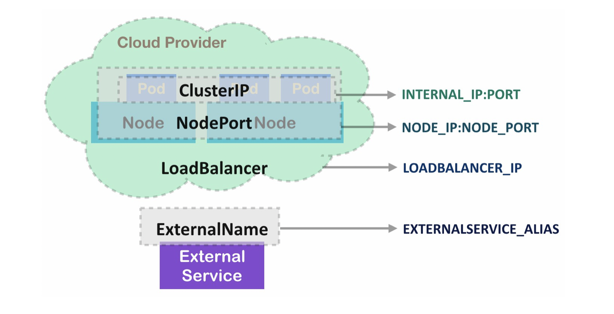
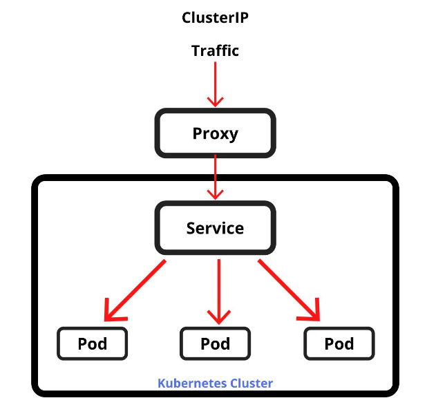
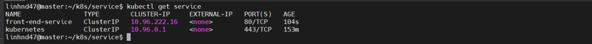
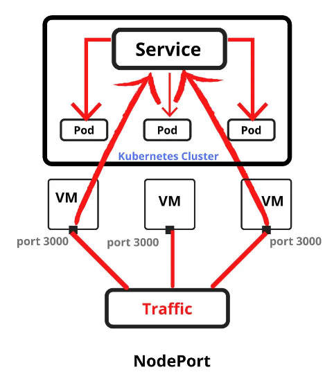
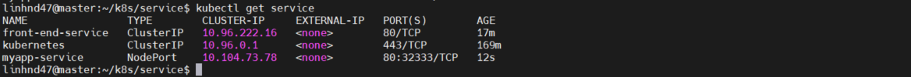
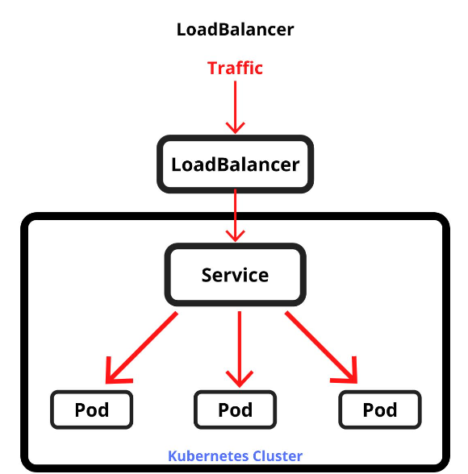
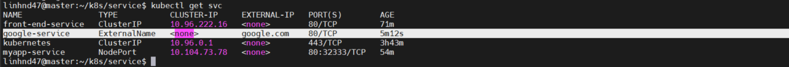

## `1.Service trong K8S là gì?`

- Service là một trong những khái niệm cốt lõi của Kubernetes. Kubernetes service là một tài nguyên xác định ra một pod hoặc một nhóm các pod cung cấp cùng một dịch vụ và chính sách truy cập đến các pod đó.
- Kubernetes cũng là một hệ sinh thái lớn và đang phát triển nhanh chóng từ các dịch vụ, hỗ trợ, công cụ.

## `2.Các loại Kubernetes Service?`

### Hiện tại Kubernetes cung cấp cho chúng ta 4 loại:

- `ClusterIP`
- `NodePort`
- `Load Balancer`
- `ExternalName`

### _ClusterIP_

- ClusterIP service là loại service mặc định trong Kubernetes.
- Service loại ClusterIP này sẽ có thể được truy cập bởi các ứng dụng khác chỉ khi các ứng dụng đó cũng nằm trong cụm của bạn.
- Các ứng dụng bên ngoài cụm sẽ không thể truy cập đến service.

#### Ví dụ:

- Tạo 1 pod với manifest file `pod_service.yaml` sau:

        apiVersion: v1
        kind: Pod
        metadata:
          name: myapp-pod
          labels:
            app: myapp
            type: front-end
        spec:
          containers:
            - name: nginx-container
              image: nginx

- Tiếp theo tạo service loại ClusterIP `service-clusterip.yaml`:

          apiVersion: v1
          kind: Service
          metadata:
            name: front-end-service
          spec:
            type: ClusterIP
            selector:
              app: myapp
              type: front-end
          ports:
            - targetPort: 80
              port: 80

  --> _Service trên cũng sử dụng selector để liên kết service với pod vừa được tạo thông qua các label. Ngoài ra, ta còn có targetPort và port_:

  - `TargetPort`: là cổng trên pod, nơi máy chủ web thực đang chạy, service sẽ chuyển tiếp lưu lượng truy cập đến cổng này.

  * `Port`: là port được mở của chính service

Sau khi tạo pod và service thì chúng ta kiểm tra **kubectl get service**:

--> _Tên của service có thể được các pod khác trong cụm sử dụng để truy cập nó. Ngoài ra thì bạn cũng không thể truy cập đến pod từ bên ngoài cụm._

### _NodePort_

- Service kiểu NodePort là một cách đơn giản nhất để có thể truy cập đến service của bạn từ phía bên ngoài cụm.
- Hay sử dụng nó cho mục đích gỡ lỗi, khi mình muốn có thể dễ dàng kiểm tra dịch vụ của mình từ phía bên ngoài cụm.
- Nó sẽ mở một port cụ thể trên tất cả các node trong cụm
- Phạm vi port được mở 30000-32767.

**Ví dụ**: tạo file service-nodeport.yaml

        apiVersion: v1
        kind: Service
        metadata:
          name: myapp-service
        spec:
          type: NodePort
          selector:
            app: myapp
            type: front-end
          ports:
            - targetPort: 80       #Là port của Pod, service sẽ chuyển tiếp kết nối vào đây
              port: 80             #Là port được mở của Service. Client sẽ kết nối với Service qua port
              nodePort: 32333      #cổng được mở trên node để nhận request cho service

Sau khi tạo chúng ta kiểm tra:

Tiếp tục ta thử curl để kiểm tra với ip của node và cổng 32333:

- `Một vài chú ý: `
  Loại service này tuy là một cách rất thuận tiện để bạn có thể dễ dàng truy cập ứng dụng bên trong cụm của bạn từ mạng bên ngoài, thế nhưng có một số điểm cần lưu ý như:

  - Chỉ có thể sử dụng một dịch vụ cho mỗi cổng, số cổng cũng phải nằm trong phạm vi 30000–32767.
  - Địa chỉ ip node cụm của bạn cũng có thể thay đổi
  - Chỉ nên sử dụng service NodePort trong những trường hợp thử nghiệm tạm thời, gỡ lỗi dịch vụ mà không nên sử dụng trên môi trường production.
  - không nên sử dụng NodePort trong quá trình sản xuất để lộ các dịch vụ.

### _LoadBalancer_

- Service này được sử dụng một cân bằng tải với mục đích sử dụng để phân phối lưu lượng truy cập đến các pod trong cụm Kubernetes. Được sử dụng phổ biến nhất trong mạng K8s.
- Đây là dịch vụ cân bằng tải tiêu chuẩn chạy trên mỗi nhóm và thiết lập kết nối với thế giới bên ngoài.
- Service LoadBalancer nó sẽ tạo ra service NodePort. Cùng với đó, nó sẽ gửi một thông báo tới nhà cung cấp lưu trữ cụm Kubernetes yêu cầu loadbalancer được thiết lập trỏ đến tất cả các node IP bên ngoài và nodePort cụ thể. Điều này cũng có nghĩa là, service LoadBalancer sẽ khả dụng khi nhà cung cấp lưu trữ cụm Kubernetes của bạn có hỗ trợ thiết lập bộ cân bằng tải bên ngoài (external load balancers), nếu không thì không có gì xảy ra và LoadBalancer sẽ tương tự như NodePort.
- Service LoadBalancer là một cách tiêu chuẩn để truy cập rộng rãi dịch vụ của bạn trên internet.

### _ExternalName_

- Loại service này không sử dụng selectors mà thay vào đó lại sử dụng tên DNS
- Nó ánh xạ một service với một tên DNS là nội dung của trường externalName (Ví dụ: app.test.com)
- Khi bạn muốn truy cập vào tên service đó, thay vì trả về cluster-ip của service này, nó sẽ trả về bản ghi CNAME với giá trị được đề cập trong externalName.

**Ví Dụ**

        apiVersion: v1
        kind: Service
        metadata:
          name: "google-service"
        spec:
          ports:
            - port: 80
          type: ExternalName
          externalName: google.com

Kiểm tra:

### _Cách tạo nhanh một deployment_

- Chúng ta có thể expose một deployment trực tiếp bằng lệnh kubectl expose. Khi không chỉ định tham số "--type" thì mặc định kubernetes sẽ tạo ra ClusterIP service.

      kubectl -n demo expose deployment myapp-deployment --port=80 --target-port=80  --name=svc-clusterip service/svc-clusterip exposed

- Để exposer một deployment dưới dạng NodePort Service ta cần chỉ định thêm giá trị "--type=NodePort":

        kubectl -n demo expose deployment myapp-deployment --type=NodePort --port=80 --target-port=80  --name=svc-nodeport service/svc-nodeport exposed
