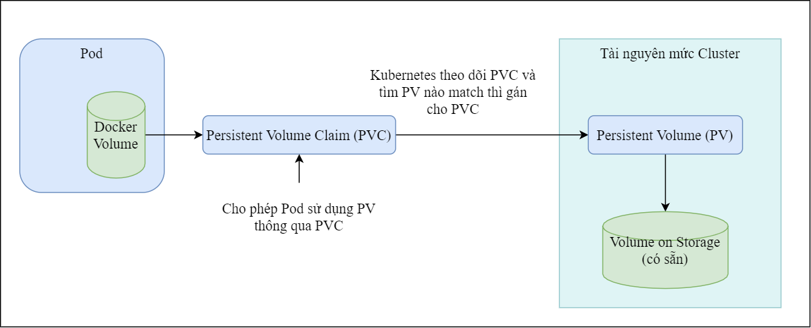
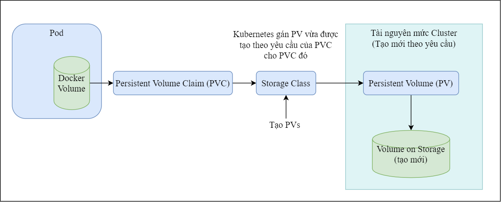
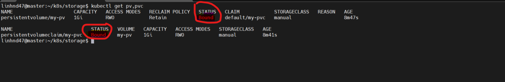
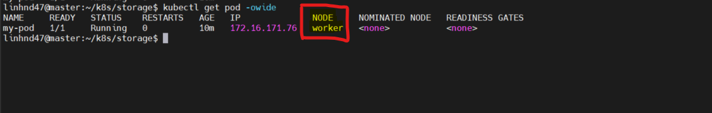
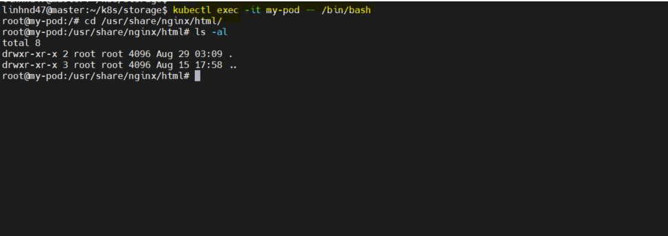
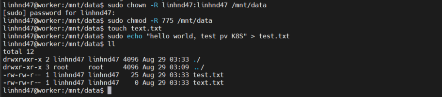
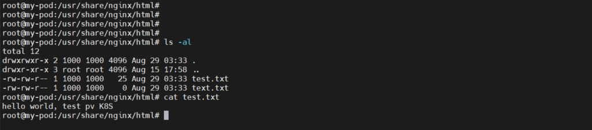

## `1.Tổng quan về Storage K8S`

- Kubernetes storage được thiết kế để đáp ứng nhu cầu lưu trữ của các ứng dụng hiện đại.

- Storage trong Kubernetes có thể được chia thành nhiều loại dựa trên tính chất lưu trữ, thời gian sống, và cách thức triển khai.

## `2.Các thành phần chính của Storage trong K8S`

### `a. Volumes`

- Volumes là đơn vị lưu trữ gắn kết với một Pod.

- Mỗi volume trong Kubernetes có thể được chia sẻ giữa các container trong cùng một Pod và duy trì dữ liệu khi container restart (khởi động lại), nhưng dữ liệu sẽ bị mất khi Pod bị xóa.

#### _Một số loại phổ biến:_

- EmptyDir: Một thư mục rỗng được tạo ra mỗi khi Pod được gán vào một node, thường được sử dụng để lưu trữ dữ liệu tạm thời.

- HostPath: Gắn kết một thư mục hoặc file từ node vào container.

- nfs: Gắn kết một thư mục từ máy chủ NFS vào Pod.

- persistentVolumeClaim (PVC): Yêu cầu một Persistent Volume từ một pool được quản lý bởi cluster.

### `b. Persistent Volumes (PV)`

- Persistent Volumes là một đối tượng quản lý lưu trữ trong Kubernetes.

- PV là tài nguyên lưu trữ trong cluster có thể được yêu cầu bởi người dùng và sử dụng bởi các Pods.

- PV tồn tại độc lập với vòng đời của Pod, có nghĩa là dữ liệu vẫn tồn tại ngay cả khi Pod bị xóa.

#### _Các loại PV phổ biến:_

- GCEPersistentDisk: Disk từ Google Compute Engine.

- AWSElasticBlockStore: Lưu trữ khối từ Amazon Web Services.

- AzureDisk: Disk từ Microsoft Azure.

- NFS: Network File System.

- iSCSI: Internet Small Computer Systems Interface.

#### _Cách tạo PV_

PV có thể được tạo bởi 2 cách: Thủ công (Static) và tự động (Dynamic):

_`Static`: Cluster Admin sẽ tạo thủ công trước một số PV. Sau đó khi tạo thì các PV này sẽ sẵn sàng cho user/app sử dụng. User khai báo các PVC và PV nào match với các yêu cầu trong PVC đó thì sẽ được sử dụng._

_`Dynamic`: Khi không có static PV nào thỏa mãn điều kiện của PVC, thì Cluster sẽ tìm cách để tạo các PVs theo yêu của PVC. Cách tạo này dựa trên storage class: PVC phải yêu cầu một storage class và storage class đó phải được cấu hình sẵn việc tạo PV tự động. Các PVC set không chỉ định storage class nghĩa là disable việc tạo tự động PV cho nó._

#### _Gán PV cho PVC (Binding)_

- Khi PVC được tạo ra với yêu cầu về một dung lượng storage nhất định cùng với access mode, thành phần controller của cluster sẽ theo dõi PVC mới tạo và tìm các PV nào “match” với yêu cầu của PVC này, và “gán” (bind) chúng lại với nhau.

- Khi đó PVC sẽ ở trạng thái “Bound“. Nếu một PV được tạo động (dynamically) cho một PVC mới, thì controller sẽ luôn gán PV đó cho PVC.

- PVC sẽ ở trạng thái Unbound mãi nếu như không có PV nào thỏa mãn điều kiện cho nó. Và nó sẽ chuyển trạng thái Bound khi có PV match với yêu cầu của nó.

- Ví dụ bạn tạo một PVC yêu cầu cấp dung lượng 100Gi, và cluster dù có sẵn rất nhiều PV có dung lượng 50Gi thì vẫn không có PV nào match với yêu cầu của PVC trên. PVC này sẽ chỉ được Bound nếu có PV có dung lượng 100Gi được add vào cluster.

#### _Persistent Volume Claims (PVC)_

- PVC là một yêu cầu của người dùng để sử dụng một PV có các thuộc tính cụ thể như kích thước, kiểu lưu trữ (ví dụ: block hoặc file), và chế độ truy cập (read/write).

- PVC trừu tượng hóa việc yêu cầu lưu trữ và làm cho người dùng không phải quan tâm đến các chi tiết của storage backend.

**Modes Access của PVC**:

- ReadWriteOnce (RWO): Volume có thể được gắn kết ở chế độ đọc/ghi bởi một node.

- ReadOnlyMany (ROX): Volume có thể được gắn kết ở chế độ chỉ đọc bởi nhiều nodes.

- ReadWriteMany (RWX): Volume có thể được gắn kết ở chế độ đọc/ghi bởi nhiều nodes.

### `c.Storage Classes`

- Storage Class là một cách để định nghĩa các lớp lưu trữ khác nhau có sẵn trong cluster.

- Mỗi lớp lưu trữ có thể sử dụng một loại provisioner khác nhau (cơ chế cấp phát) để tạo ra Persistent Volumes.

- Storage Class định nghĩa các yếu tố như tốc độ, loại ổ đĩa (SSD/HDD), và các thông số kỹ thuật khác.

_Một số provisioners phổ biến:_

- kubernetes.io/gce-pd: Google Compute Engine Persistent Disk.

- kubernetes.io/aws-ebs: AWS Elastic Block Store.

- kubernetes.io/azure-disk: Azure Disk.

- kubernetes.io/cinder: OpenStack Cinder.

### `d.Cơ chế reclaiming`

Khi một PV không còn được sử dụng, Kubernetes sẽ áp dụng chính sách reclaim (giải phóng tài nguyên). Các chính sách bao gồm:

- Retain: Giữ lại dữ liệu sau khi PVC bị xóa.

- Recycle: Xóa dữ liệu cũ và làm cho PV có thể tái sử dụng.

- Delete: Xóa PV và các dữ liệu liên quan khi PVC bị xóa.

## `3. Sử dụng Storage trong K8S`

_a. Tạo PV_

    apiVersion: v1
    kind: PersistentVolume
    metadata:
      name: my-pv
    spec:
      capacity:
        storage: 1Gi
      accessModes:
        - ReadWriteOnce
      persistentVolumeReclaimPolicy: Retain
      storageClassName: manual              # match với pvc
      hostPath:
        path: /mnt/data

_b. Tạo PVC_

    apiVersion: v1
    kind: PersistentVolumeClaim
    metadata:
      name: my-pvc
    spec:
      accessModes:
        - ReadWriteOnce
      resources:
        requests:
          storage: 1Gi
      storageClassName: manual             # match với pv

_c. Sử dụng PVC trong POD_

    apiVersion: v1
    kind: Pod
    metadata:
      name: my-pod
    spec:
      containers:
      - name: my-container
        image: nginx
        volumeMounts:
        - mountPath: "/usr/share/nginx/html"
          name: my-storage
      volumes:
      - name: my-storage
        persistentVolumeClaim:
          claimName: my-pvc             # là name của pvc

_d. Kiểm tra_

**Show pv và pvc xem đã bound với nhau:**

**Kiểm tra pod được chạy trên woker nào:**

**Vào trong thư mục /usr/share/nginx/html trong container check thư mục hiện tại đang chưa có file nào:**

`kubectl exec -it my-pod -- /bin/bash`

**Ta vào thư mục /mnt/data trên woker để tạo thử 1 file test.txt**

**Sau đó ta vào lại trong container check nếu có 2 file như trên thì là thành công!**

