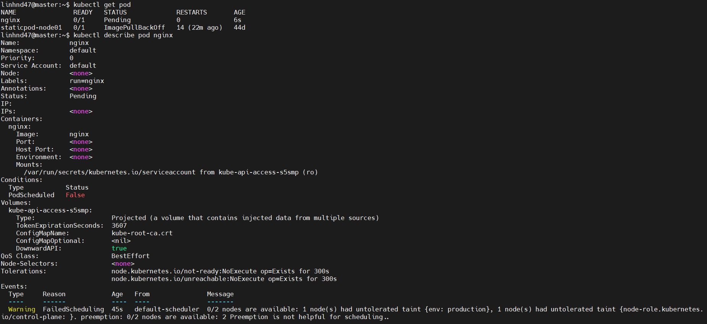

_"Trong Kubernetes, taints và tolerations được sử dụng để kiểm soát việc lập lịch các pod vào các nút trong một cụm. Chúng giúp đảm bảo rằng chỉ một số pod nhất định được đặt trên các nút cụ thể, dựa trên các điều kiện và yêu cầu cụ thể"_

## `1.Tain`

- Taints được dùng để cấm một thằng pod được deploy tới worker node mà có taints. Ta sẽ dùng câu lệnh để đánh taints vào một worker node.
- Ví dụ ta có cụm worker node chạy môi trường production, ta sẽ đánh taints lên cụm worker node đó, và pod sẽ không thể được deploy lên cụm worker node này nữa.

### `Câu lệnh cấu hình tain`

Cấu trúc tain gồm 3 phần chính key, value, effect:

    	kubectl taint nodes <node-name> key=value:effect

    vd: kubectl taint nodes node1 key=value:NoSchedule

- Effect có 3 option:

  - `NoSchedule`: Không cho phép pod không có toleration chạy trên node.
  - `PreferNoSchedule`: Hạn chế pod chạy trên node nhưng không hoàn toàn cấm.
  - `NoExecute`: Xóa các pod hiện tại và không cho phép các pod mới chạy trên node nếu không có toleration.

## `2.Toleration`

- Tolerations cho phép các pod được lên lịch trên các node có taints phù hợp.
- Được cấu hình trên pod.
- Ví dụ như cụm worker node production ở trên ta gán taints cho nó, sau đó, ta sẽ chỉ định tolerations lên những pod production, thì bây giờ chỉ có những pod production có tolerations phù hợp mới có thể được deploy lên cụm worker node production, còn pod dev thì không.

Cấu trúc Toleration:

- Cũng bao gồm key, value, và effect tương tự như taint.
- Nếu một pod có toleration khớp với taint của node, pod sẽ được phép chạy trên node đó.

        tolerations:
        - key: "key"
          operator: "Equal"
          value: "value"
          effect: "NoSchedule"

## `3. Sự khác biệt chính`

- Taints: Được dùng để ngăn chặn pod chạy trên các node cụ thể, trừ khi pod đó có một toleration tương ứng.
- Tolerations: Cho phép các pod vượt qua các taint trên node và được lên lịch trên các node có taints tương ứng.

## `4. Cấu hình`

1.  Tạo tain trên node 1 bằng câu lệnh

        kubectl taint nodes node01 env=production:NoSchedule

2.  Tạo 1 pod bằng lệnh sau

        kubectl run nginx --image=nginx

    Ta thấy bị lỗi do tạo tain trên node

    

3.  Tạo 1 pod mới sử dụng toleration

        apiVersion: v1
        kind: Pod
        metadata:
          name: kubenode
        spec:
          containers:
          - name: my-container
            image: nginx:latest
          tolerations:
          - key: "env"
            operator: "Equal"
            value: "production"
            effect: "NoSchedule"

Muốn untain ta sử dụng lệnh sau:

        kubectl taint nodes node1 key1=value1:NoSchedule-
