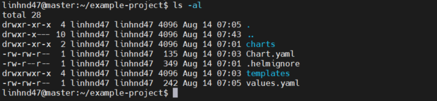

## 1. Tạo ra 1 helm chart bằng lệnh:

        helm create example-project

- Ta sẽ 1 thư mục example-project gồm các file như hình sau:

- Tuỳ chỉnh theo ý mình trong file template default sẽ có:

  - deployment.yaml deployment với kubernetes
  - \_helpers.tpl mẫu có sẵn có thể tái sử dụng trong chart
  - ingress.yaml liệt kê triển khai các quyền để ứng dụng của bạn truy cập được kubernetes
  - serviceaccount.yaml tạo tài khoản cho service mình dùng phần này có ví dụ cài đặt ingress-nginx
  - service.yaml triển khai các deployment với các service
  - tests/ thư mục chứa các testing về chart

## 2. Chúng ta sẽ tạo lại chart từ đầu và sẽ xoá các file sau:

        rm -rf example-project/templates/
        rm -rf example-project/Chart.yaml
        rm -rf example-project/values.yaml

## 3. sau đó thiết lập chart theo dự án của mình (Tạo file Chart.yaml với nd bên dưới)

        cat <<EoF > example-project/Chart.yaml
        apiVersion: v2
        name: example-project
        description: A Helm chart for Kubernetes Microservices
        application
        version: 0.1.0
        appVersion: 1.0
        EoF

## 4. Tiếp theo tạo các folder deployment và service đơn giản trong templates

            mkdir -p example-project/templates/deployment
            mkdir -p example-project/templates/service

## 5. Tạo 2 file coffee-dpl.yaml trong deployment và coffee-service.yaml trong thư mục service:

- cd /example-project/templates/deployment/

        apiVersion: apps/v1
        kind: Deployment
        metadata:
        name: coffee
        spec:
        replicas: {{ .Values.replicas }}
        selector:
            matchLabels:
            app: coffee
        template:
            metadata:
            labels:
                app: coffee
            spec:
            containers:
            - name: coffee
                image: {{ .Values.hello.image }}:{{ .Values.version }}
                ports:
                - containerPort: 80

- cd /example-project/templates/service/

        apiVersion: v1
        kind: Service
        metadata:
        name: coffee-svc
        spec:
        ports:
        - port: 80
            targetPort: 80
            protocol: TCP
            name: http
        selector:
            app: coffee

## 6. Tiếp theo ta tạo file values.yaml

- vim /example-project/values.yaml

        # Default values for example-project.
        # This is a YAML-formatted file.
        # Declare variables to be passed into your templates.

        # Release-wide Values
        replicas: 3
        version: 'plain-text'

        # Service Specific Values
        hello:
        image: nginxdemos/hello

## 7. Test Chart để xác nhận config chính xác:

    helm install --debug --dry-run example-project example-project

--

## 8. Khi xác nhận không có lỗi ta sẽ deploy

        helm install example-project example-project

- Kiểm tra các status của svc,deploy, pod

          kubectl get svc,po,deploy

  

- Ta test thử nội dung của nginx

        kubectl describe svc coffee-s

  

- curl 172.16.171.82

  

## Khi chúng ta update helm mà bị lỗi thì ta có thể rollback lại phiên bản cũ

        helm upgrade example-project example-project
        helm history example-project
        helm rollback example-project 1
        helm uninstall example-project - xoá example-project
