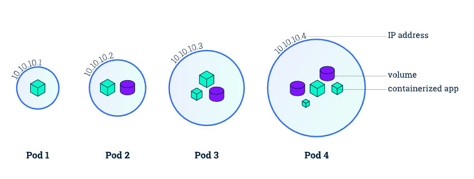

## 1.`Khái niệm`

- Pod là thành phần đơn vị (nhỏ nhất) để Kubernetes thực hiện việc nhân bản (replication)
- Kubernetes có thể thực hiện nhân bản ra nhiều pod có chức năng giống nhau để tránh quá tải hoặc để đảm bảo tính sẵn sàng.
- Pod có thể có nhiều container bên trong.

  

## 2.`Thành phần file Pod`

- Kind: để phân loại tài nguyên như Deployment, Service,...
- Metadata: chứa thêm tin metadata của Pod và 1 số tham số chính như tên pod, label,...

        metadata:
          creationTimestamp: null
          labels:
            appname: http
            apptype: webapp
          name: http-pod

- spec: Đây là phần quan trọng nhất, nơi chứa các thông tin khai báo cho Pod và cho các Container trong Pod:

        spec:
          hostAliases:
          initContainers:
          containers:
          volumes:
          restartPolicy:
          affinity:

  Trong đó:

  - `hostAliases`: Giống như ta khai báo host trong file /etc/hosts của máy chủ vậy. Nhưng ở đây ta khai báo cho Pod
  - `initContainers`: Khai báo thông tin của initContainer (nếu có)
  - `container`: Định nghĩa thông tin chi tiết cho các container của Pod.
  - `volumes`: Khai báo Volume cho Pod. Volume có thể lấy từ configmap, từ PVC.. Các phần này sẽ được đề cập sau khi ta làm quen với PV/PVC
  - `restartPolicy`: Có 3 giá trị là Always, OnFailure, và Never.
  - `affinity`: Là đối tượng khai báo các thuộc tính liên quan tới schedule Pod

--> Lưu ý rằng thông tin container name, image là bắt buộc còn lại là optional.

## 3.`Một số lệnh Pod`

- Tạo pod tên `nginx-pod` từ image `nginx` và listen ở port `80` bằng lệnh:

        kubectl run nginx-pod --image=nginx --port=80

- Thêm cấu hình "--dry-run=client -oyaml" để xem trước cấu hình được gen ra chứ không apply vào hệ thống ngay:

        kubectl run nginx-pod --image=nginx --port=80 --dry-run=client -oyaml

- Xem log pod:

        #Log của pod tên là pod-name
        kubectl logs pod/pod-name
  
        #Log tất cả các Pod có label là app=pod-name
        kubectl logs -l "app=pod-name"
- Thay đổi tham số trong file pod:

        kubectl edit pod/<name_pod>
- Xem chi tiết:

        kubectl describe pod/<name_pod>

## 4. `Scalling`

- Ngoài việc chỉnh sửa thủ công cấu hình pod, Kubernetes còn hỗ trợ tính năng mở rộng theo chiều dọc động thông qua tính năng Horizontal Pod Autoscaler (HPA) .
- HPA tự động điều chỉnh giới hạn tài nguyên cho pod dựa trên mức sử dụng hiện tại của chúng.

        kubectl autoscale deployment/my-deployment --min=2 --max=10 --cpu-percent=80
## 5. `Ephemeral`
- Ephemeral containers là cung cấp một môi trường tạm thời để thực hiện các tác vụ gỡ lỗi hoặc kiểm tra với các công cụ/mô-đun không có sẵn trong container chính
  
      kubectl debug -it pod/<pod-name> --image=busybox --target=<tên pod muốn vào> -- sh
